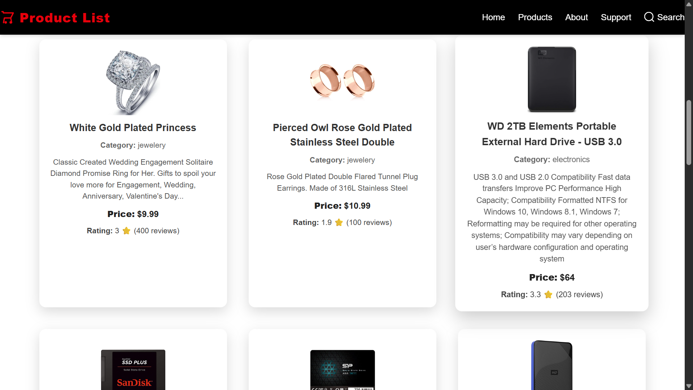

# 🛍️ Product List Web App

A responsive product display webpage built using **HTML**, **JavaScript**, and **Tailwind CSS**. It fetches live product data from the [Fake Store API](https://fakestoreapi.com/) and displays it in a modern, elegant layout.

---

## 📸 Screenshot

 <!-- Make sure to place your image in the root and rename to screenshot.png -->

---

## 🚀 Features

- Live product fetching from API
- Responsive grid layout using Tailwind CSS
- Elegant cards with hover effects
- Sticky & clean navigation bar
- Rating, price, and category display
- Styled footer using Tailwind

---

## 🛠️ Technologies Used

- **HTML5**
- **Tailwind CSS**
- **Vanilla JavaScript**
- **Fake Store API**

---

## 📂 Folder Structure

project/
│
├── index.html
├── script.js
├── src/
│ ├── input.css # Tailwind directives
│ └── output.css # Generated Tailwind CSS
├── screenshot.png # App preview
└── README.md


---

## 🔧 Setup Instructions

1. **Clone the repository**
   ```bash
   git clone https://github.com/your-username/product-list-app.git

npm install -D tailwindcss
npx tailwindcss init

npx tailwindcss -i ./src/input.css -o ./src/output.css --watch

🧑‍💻 Author
Shubham Kumar
LinkedIn: linkedin.com/in/shubhamsharma0
Email: kumarshubham5559@gmail.com

📜 License
This project is licensed under the MIT License.
